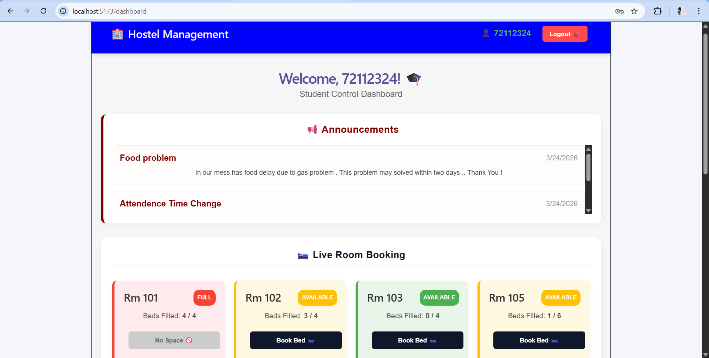

# 🏨 Smart Hostel Management System (Full-Stack)

A modern, role-based application built with **React**, **Spring Boot**, and **MySQL** to manage hostel operations seamlessly.

## 🚀 Key Features
- **Student Dashboard:** Room booking, Leave application, and Complaint registration.
- **Warden Dashboard:** Broadcast notices, Approve/Reject leaves, and Resolve complaints.
- **Live Room Grid:** Real-time visual status of room availability.
- **UI/UX:** Smooth CSS animations and responsive design.

## 🛠️ Tech Stack
- **Frontend:** React.js, CSS3 (Custom Animations)
- **Backend:** Java Spring Boot, Hibernate
- **Database:** MySQL
- **Tools:** Git, Vite, Maven
